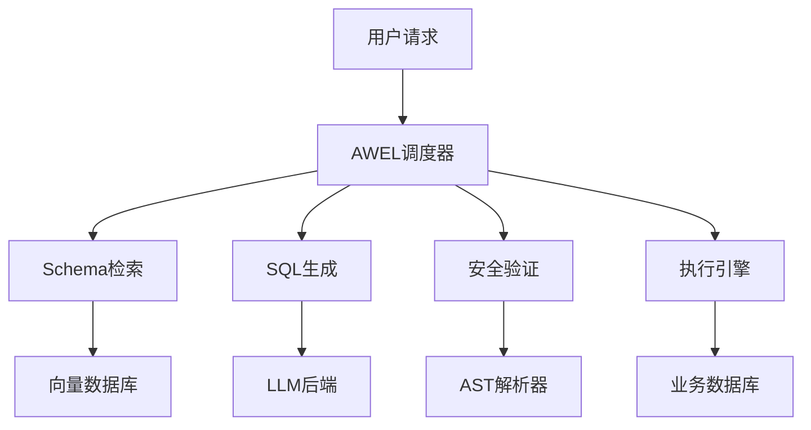

# AI工作流集成专业知识

## DB-GPT AWEL架构深度解析

### 核心组件架构


### AWEL工作流设计模式

#### 1. 线性流水线模式
```python
from dbgpt.core.awel import DAG

with DAG("linear_pipeline") as dag:
    input_node = dag.input()
    process1 = ProcessNode1()(input_node)
    process2 = ProcessNode2()(process1)
    output = dag.output()(process2)
```

#### 2. 分支合并模式
```python
with DAG("branch_merge") as dag:
    input_node = dag.input()
    branch1 = BranchNode1()(input_node)
    branch2 = BranchNode2()(input_node)
    merged = MergeNode()(branch1, branch2)
    output = dag.output()(merged)
```

#### 3. 条件路由模式
```python
with DAG("conditional_routing") as dag:
    input_node = dag.input()
    condition = ConditionNode()(input_node)
    path1 = PathNode1()(condition.if_true())
    path2 = PathNode2()(condition.if_false())
    output = dag.output()(path1, path2)
```

## Text-to-SQL核心技术

### Schema RAG策略
1. **Schema向量化**
   ```python
   # 表结构向量化
   table_embeddings = embed_model.encode([
       f"表名: {table.name}, 描述: {table.comment}",
       f"字段: {', '.join([col.name for col in table.columns])}"
   ])
   ```

2. **相关性检索**
   ```python
   # 基于问题检索相关表
   question_embedding = embed_model.encode(user_question)
   similar_tables = vector_db.similarity_search(
       question_embedding, 
       top_k=5
   )
   ```

3. **上下文构建**
   ```python
   # 构建SQL生成上下文
   context = f"""
   相关表结构:
   {format_schema(similar_tables)}
   
   用户问题: {user_question}
   
   请生成SQL查询:
   """
   ```

### AST安全白名单

#### SQL解析与验证
```python
import sqlglot

def validate_sql_safety(sql_text):
    try:
        # 解析SQL为AST
        ast = sqlglot.parse_one(sql_text, dialect="mysql")
        
        # 检查危险操作
        dangerous_nodes = [
            "Drop", "Delete", "Update", "Insert", 
            "Alter", "Create", "Truncate"
        ]
        
        for node in ast.walk():
            if type(node).__name__ in dangerous_nodes:
                raise SecurityError(f"禁止的SQL操作: {type(node).__name__}")
                
        return True
    except Exception as e:
        raise ValidationError(f"SQL解析失败: {e}")
```

#### 白名单规则配置
```yaml
sql_whitelist:
  allowed_statements:
    - SELECT
    - WITH
  allowed_functions:
    - COUNT
    - SUM
    - AVG
    - MAX
    - MIN
    - DATE_FORMAT
  forbidden_keywords:
    - DROP
    - DELETE
    - UPDATE
    - INSERT
    - ALTER
    - TRUNCATE
  max_result_rows: 10000
  timeout_seconds: 30
```

### 执行反馈自修正循环

#### 错误捕获与分析
```python
class SQLExecutionFeedback:
    def __init__(self, max_retries=3):
        self.max_retries = max_retries
    
    def execute_with_feedback(self, sql, context):
        for attempt in range(self.max_retries):
            try:
                result = self.execute_sql(sql)
                return result
            except Exception as e:
                if attempt < self.max_retries - 1:
                    # 生成修正提示
                    fix_prompt = self.generate_fix_prompt(sql, str(e), context)
                    sql = self.llm_fix_sql(fix_prompt)
                else:
                    raise e
    
    def generate_fix_prompt(self, sql, error, context):
        return f"""
        原始SQL: {sql}
        执行错误: {error}
        数据库Schema: {context}
        
        请修正SQL语句以解决上述错误:
        """
```

#### LLM Judge重排机制
```python
def llm_judge_ranking(candidates, question, schema):
    judge_prompt = f"""
    问题: {question}
    Schema: {schema}
    
    候选SQL:
    {format_candidates(candidates)}
    
    请评估每个SQL的正确性和效率，按分数排序:
    """
    
    scores = llm.evaluate(judge_prompt)
    return sorted(zip(candidates, scores), key=lambda x: x[1], reverse=True)
```

## 前端集成策略

### 嵌入式集成
```javascript
// React组件嵌入
import { ChatInterface } from '@dbgpt/react';

function App() {
  return (
    <div className="app">
      <ChatInterface 
        apiEndpoint="/api/v1/chat"
        theme="light"
        enableSQL={true}
      />
    </div>
  );
}
```

### iframe集成
```html
<!-- 简单iframe嵌入 -->
<iframe 
  src="http://dbgpt:3000/chat" 
  width="100%" 
  height="600px"
  frameborder="0">
</iframe>
```

### API集成
```javascript
// 自定义前端调用API
async function queryWithNL(question) {
  const response = await fetch('/api/v1/chat/completions', {
    method: 'POST',
    headers: { 'Content-Type': 'application/json' },
    body: JSON.stringify({
      model: 'text-to-sql',
      messages: [{ role: 'user', content: question }]
    })
  });
  
  return response.json();
}
```

## 性能优化策略

### 缓存机制
- **Schema缓存**：表结构信息缓存
- **查询缓存**：相同问题结果缓存
- **向量缓存**：embedding结果缓存

### 并发控制
- **连接池管理**：数据库连接池优化
- **请求限流**：防止系统过载
- **异步处理**：长时间查询异步执行

### 监控指标
- **响应时间**：端到端查询时间
- **成功率**：SQL生成和执行成功率
- **资源使用**：CPU、内存、GPU使用率
