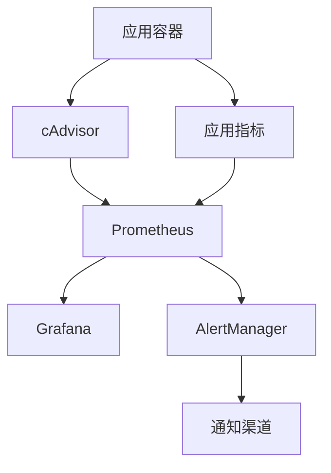

# DevOps最佳实践知识

## CI/CD流水线设计

### GitHub Actions with Podman
```yaml
name: CI/CD Pipeline

on:
  push:
    branches: [ main, develop ]
  pull_request:
    branches: [ main ]

jobs:
  build-and-test:
    runs-on: ubuntu-latest
    
    steps:
    - uses: actions/checkout@v3
    
    - name: Setup Podman
      run: |
        sudo apt-get update
        sudo apt-get install -y podman podman-compose
        
    - name: Build Images
      run: |
        podman build -t app:${{ github.sha }} .
        podman build -t app:latest .
        
    - name: Security Scan
      run: |
        podman run --rm -v /var/run/docker.sock:/var/run/docker.sock \
          aquasec/trivy image app:${{ github.sha }}
          
    - name: Run Tests
      run: |
        podman-compose -f docker-compose.test.yml up --abort-on-container-exit
        
    - name: Push Images
      if: github.ref == 'refs/heads/main'
      run: |
        echo ${{ secrets.REGISTRY_PASSWORD }} | \
          podman login -u ${{ secrets.REGISTRY_USERNAME }} --password-stdin ghcr.io
        podman push ghcr.io/${{ github.repository }}:${{ github.sha }}
        podman push ghcr.io/${{ github.repository }}:latest
```

### 多环境部署策略

#### 环境配置管理
```yaml
# environments/dev.yml
environment: development
database:
  host: dev-db.internal
  port: 5432
  name: app_dev
  
scaling:
  replicas: 1
  resources:
    cpu: "0.5"
    memory: "512Mi"

# environments/prod.yml  
environment: production
database:
  host: prod-db.internal
  port: 5432
  name: app_prod
  
scaling:
  replicas: 3
  resources:
    cpu: "2"
    memory: "4Gi"
```

#### Blue/Green部署
```bash
#!/bin/bash
# blue-green-deploy.sh

CURRENT_COLOR=$(podman pod ps --filter "label=app=myapp" --filter "label=active=true" --format "{{.Labels.color}}")
NEW_COLOR=$([ "$CURRENT_COLOR" = "blue" ] && echo "green" || echo "blue")

echo "当前活跃环境: $CURRENT_COLOR"
echo "部署到环境: $NEW_COLOR"

# 部署新版本到非活跃环境
podman-compose -f docker-compose.$NEW_COLOR.yml up -d

# 健康检查
for i in {1..30}; do
  if curl -f http://localhost:808$([[ "$NEW_COLOR" = "blue" ]] && echo "1" || echo "2")/health; then
    echo "健康检查通过"
    break
  fi
  sleep 10
done

# 切换流量
podman pod stop myapp-$CURRENT_COLOR
podman pod start myapp-$NEW_COLOR

# 更新标签
podman pod label myapp-$CURRENT_COLOR active=false
podman pod label myapp-$NEW_COLOR active=true

echo "部署完成，流量已切换到 $NEW_COLOR 环境"
```

## 监控与可观测性

### 指标收集架构


### Prometheus配置
```yaml
# prometheus.yml
global:
  scrape_interval: 15s
  evaluation_interval: 15s

rule_files:
  - "alert_rules.yml"

scrape_configs:
  - job_name: 'podman-containers'
    static_configs:
      - targets: ['cadvisor:8080']
      
  - job_name: 'application'
    static_configs:
      - targets: ['app:8080']
    metrics_path: '/metrics'
    
alerting:
  alertmanagers:
    - static_configs:
        - targets: ['alertmanager:9093']
```

### 关键告警规则
```yaml
# alert_rules.yml
groups:
- name: application_alerts
  rules:
  - alert: HighErrorRate
    expr: rate(http_requests_total{status=~"5.."}[5m]) > 0.1
    for: 5m
    labels:
      severity: critical
    annotations:
      summary: "应用错误率过高"
      
  - alert: HighResponseTime
    expr: histogram_quantile(0.95, rate(http_request_duration_seconds_bucket[5m])) > 2
    for: 5m
    labels:
      severity: warning
    annotations:
      summary: "响应时间过长"
      
  - alert: ContainerDown
    expr: up == 0
    for: 1m
    labels:
      severity: critical
    annotations:
      summary: "容器服务不可用"
```

### 日志聚合
```yaml
# fluentd配置
<source>
  @type forward
  port 24224
  bind 0.0.0.0
</source>

<filter **>
  @type parser
  key_name log
  <parse>
    @type json
  </parse>
</filter>

<match **>
  @type elasticsearch
  host elasticsearch
  port 9200
  index_name application-logs
  type_name _doc
</match>
```

## 安全最佳实践

### 容器安全
```dockerfile
# 安全的Dockerfile示例
FROM registry.redhat.io/ubi8/ubi-minimal:latest

# 创建非root用户
RUN microdnf install -y shadow-utils && \
    groupadd -r appuser && \
    useradd -r -g appuser appuser

# 安装依赖
COPY requirements.txt .
RUN microdnf install -y python3 python3-pip && \
    pip3 install -r requirements.txt && \
    microdnf clean all

# 复制应用代码
COPY --chown=appuser:appuser . /app
WORKDIR /app

# 切换到非root用户
USER appuser

# 健康检查
HEALTHCHECK --interval=30s --timeout=3s --start-period=5s --retries=3 \
  CMD curl -f http://localhost:8080/health || exit 1

EXPOSE 8080
CMD ["python3", "app.py"]
```

### 镜像安全扫描
```bash
# 使用Trivy扫描镜像
trivy image --severity HIGH,CRITICAL myapp:latest

# 使用Clair扫描
clairctl analyze myapp:latest

# 使用Anchore扫描
anchore-cli image add myapp:latest
anchore-cli image wait myapp:latest
anchore-cli image vuln myapp:latest all
```

### 运行时安全
```yaml
# Pod安全策略
apiVersion: v1
kind: Pod
metadata:
  name: secure-app
spec:
  securityContext:
    runAsNonRoot: true
    runAsUser: 1000
    fsGroup: 2000
    seccompProfile:
      type: RuntimeDefault
  containers:
  - name: app
    image: myapp:latest
    securityContext:
      allowPrivilegeEscalation: false
      readOnlyRootFilesystem: true
      capabilities:
        drop:
        - ALL
    resources:
      limits:
        cpu: "1"
        memory: "1Gi"
      requests:
        cpu: "0.5"
        memory: "512Mi"
```

## 性能优化

### 资源管理
```yaml
# podman-compose.yml资源限制
version: '3.8'
services:
  app:
    image: myapp:latest
    deploy:
      resources:
        limits:
          cpus: '2.0'
          memory: 4G
        reservations:
          cpus: '1.0'
          memory: 2G
    healthcheck:
      test: ["CMD", "curl", "-f", "http://localhost:8080/health"]
      interval: 30s
      timeout: 10s
      retries: 3
      start_period: 40s
```

### 网络优化
```bash
# 创建自定义网络
podman network create --driver bridge \
  --subnet=172.20.0.0/16 \
  --gateway=172.20.0.1 \
  app-network

# 配置DNS
podman run -d --name app \
  --network app-network \
  --dns=8.8.8.8 \
  --dns-search=company.local \
  myapp:latest
```

### 存储优化
```bash
# 使用命名卷
podman volume create app-data

# 配置存储驱动
podman run -d \
  --storage-driver overlay2 \
  --storage-opt overlay2.size=20G \
  --volume app-data:/data \
  myapp:latest
```

## 故障排查

### 常用诊断命令
```bash
# 查看容器状态
podman ps -a
podman inspect <container_id>

# 查看日志
podman logs -f <container_id>
podman logs --since 1h <container_id>

# 进入容器调试
podman exec -it <container_id> /bin/bash

# 查看资源使用
podman stats
podman system df

# 网络诊断
podman network ls
podman network inspect <network_name>
```

### 性能分析
```bash
# CPU性能分析
podman exec <container_id> top
podman exec <container_id> htop

# 内存分析
podman exec <container_id> free -h
podman exec <container_id> cat /proc/meminfo

# 磁盘I/O分析
podman exec <container_id> iostat -x 1
podman exec <container_id> iotop
```
