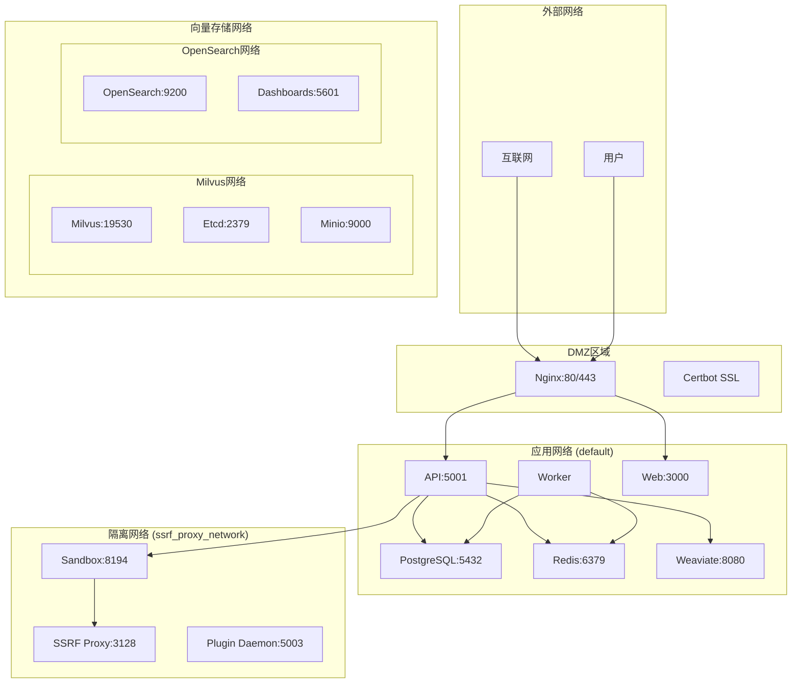

# 网络拓扑和端口映射分析

**生成时间**: 2025-06-16  
**分析范围**: sjufxxi项目Dify网络配置  
**目的**: 为Podman Pod网络设计提供基础

## 🌐 网络架构概览

### 网络分段设计


## 🔌 端口映射清单

### 对外暴露端口
| 服务 | 容器端口 | 宿主机端口 | 协议 | 用途 | 安全等级 |
|------|----------|------------|------|------|----------|
| Nginx | 80 | 80 | HTTP | Web入口 | 公开 |
| Nginx | 443 | 443 | HTTPS | 安全Web入口 | 公开 |
| Plugin Daemon | 5003 | 5003 | HTTP | 插件调试 | 开发 |

### 可选对外端口 (profiles控制)
| 服务 | 容器端口 | 宿主机端口 | 协议 | 用途 | Profile |
|------|----------|------------|------|------|---------|
| VastBase | 5432 | 5434 | TCP | 数据库访问 | vastbase |
| OceanBase | 2881 | 2881 | TCP | 数据库访问 | oceanbase |
| Milvus | 19530 | 19530 | TCP | 向量数据库 | milvus |
| Milvus | 9091 | 9091 | HTTP | 管理界面 | milvus |
| OpenGauss | 6600 | 6600 | TCP | 数据库访问 | opengauss |
| MyScale | 8123 | 8123 | HTTP | ClickHouse API | myscale |
| Elasticsearch | 9200 | 9200 | HTTP | 搜索API | elasticsearch |
| Kibana | 5601 | 5601 | HTTP | 可视化界面 | elasticsearch |

### 内部服务端口
| 服务 | 端口 | 协议 | 用途 | 网络 |
|------|------|------|------|------|
| API | 5001 | HTTP | 后端API | default |
| Web | 3000 | HTTP | 前端服务 | default |
| PostgreSQL | 5432 | TCP | 数据库 | default |
| Redis | 6379 | TCP | 缓存 | default |
| Weaviate | 8080 | HTTP | 向量数据库 | default |
| Sandbox | 8194 | HTTP | 代码执行 | ssrf_proxy_network |
| SSRF Proxy | 3128 | HTTP | 代理服务 | ssrf_proxy_network |

## 🔒 网络安全边界

### 网络隔离策略
| 网络名 | 类型 | 隔离级别 | 用途 | 安全策略 |
|--------|------|----------|------|----------|
| default | bridge | 低 | 主要应用服务 | 内部互通 |
| ssrf_proxy_network | bridge (internal) | 高 | 沙箱隔离 | 仅通过代理访问外网 |
| milvus | bridge | 中 | Milvus集群 | 集群内互通 |
| opensearch-net | bridge (internal) | 中 | OpenSearch集群 | 集群内互通 |

### 安全控制点
1. **外部访问控制**
   - 仅Nginx暴露80/443端口
   - 所有其他服务通过Nginx代理访问

2. **内部网络隔离**
   - 沙箱服务在独立网络中运行
   - SSRF代理控制沙箱的外网访问

3. **数据库访问控制**
   - 数据库仅在内部网络可访问
   - 通过应用层进行访问控制

## 🛠️ Podman Pod网络设计

### Pod划分策略
```yaml
# 核心应用Pod
core-app-pod:
  services:
    - api
    - worker
    - web
  network: pod-internal
  exposed_ports:
    - 5001:5001  # API
    - 3000:3000  # Web

# 数据存储Pod
data-storage-pod:
  services:
    - postgres
    - redis
  network: pod-internal
  exposed_ports: []  # 仅内部访问

# 向量存储Pod
vector-storage-pod:
  services:
    - weaviate
  network: pod-internal
  exposed_ports:
    - 8080:8080  # Weaviate API

# 沙箱隔离Pod
sandbox-pod:
  services:
    - sandbox
    - ssrf_proxy
  network: isolated
  exposed_ports:
    - 8194:8194  # Sandbox API

# 网关Pod
gateway-pod:
  services:
    - nginx
    - certbot
  network: external
  exposed_ports:
    - 80:80    # HTTP
    - 443:443  # HTTPS
```

### Podman网络配置
```yaml
# podman-compose.yml网络配置示例
networks:
  # 主应用网络
  app-network:
    driver: bridge
    ipam:
      config:
        - subnet: 172.20.0.0/16
          gateway: 172.20.0.1
  
  # 沙箱隔离网络
  sandbox-network:
    driver: bridge
    internal: true
    ipam:
      config:
        - subnet: 172.21.0.0/16
          gateway: 172.21.0.1
  
  # 向量存储网络
  vector-network:
    driver: bridge
    ipam:
      config:
        - subnet: 172.22.0.0/16
          gateway: 172.22.0.1
```

## ⚠️ Podman迁移风险

### 高风险项
1. **网络发现机制**
   - Docker的自动DNS解析在Podman中可能不同
   - 服务间通信可能需要调整

2. **端口冲突**
   - rootless模式下无法绑定<1024端口
   - 需要使用端口转发或调整配置

3. **网络性能**
   - CNI网络性能可能与Docker bridge不同
   - 需要进行性能基准测试

### 中风险项
1. **健康检查**
   - 网络健康检查在Pod中的行为
   - 可能需要调整检查逻辑

2. **负载均衡**
   - 如果使用了Docker的内置负载均衡
   - 需要重新设计负载均衡策略

### 低风险项
1. **基础连通性**
   - 基本的TCP/HTTP连接应该正常工作
   - 端口映射机制类似

## 📋 迁移检查清单

### 网络配置迁移
- [ ] 创建Podman网络定义
- [ ] 配置Pod内网络
- [ ] 设置服务发现
- [ ] 配置端口映射
- [ ] 测试网络连通性

### 安全配置验证
- [ ] 验证网络隔离
- [ ] 测试防火墙规则
- [ ] 检查端口暴露
- [ ] 验证SSL/TLS配置
- [ ] 测试代理功能

### 性能验证
- [ ] 网络延迟测试
- [ ] 带宽测试
- [ ] 并发连接测试
- [ ] 负载测试
- [ ] 故障转移测试

## 🔧 故障排除指南

### 常见网络问题
1. **服务无法访问**
   ```bash
   # 检查Pod网络状态
   podman pod ps
   podman network ls
   podman network inspect <network_name>
   ```

2. **DNS解析失败**
   ```bash
   # 检查容器内DNS配置
   podman exec <container> nslookup <service_name>
   podman exec <container> cat /etc/resolv.conf
   ```

3. **端口绑定失败**
   ```bash
   # 检查端口占用
   ss -tlnp | grep <port>
   # 检查rootless端口范围
   cat /proc/sys/net/ipv4/ip_unprivileged_port_start
   ```

### 网络调试工具
```bash
# 网络连通性测试
podman exec <container> ping <target>
podman exec <container> telnet <host> <port>
podman exec <container> curl -v <url>

# 网络配置查看
podman exec <container> ip addr show
podman exec <container> ip route show
podman exec <container> netstat -tlnp
```
