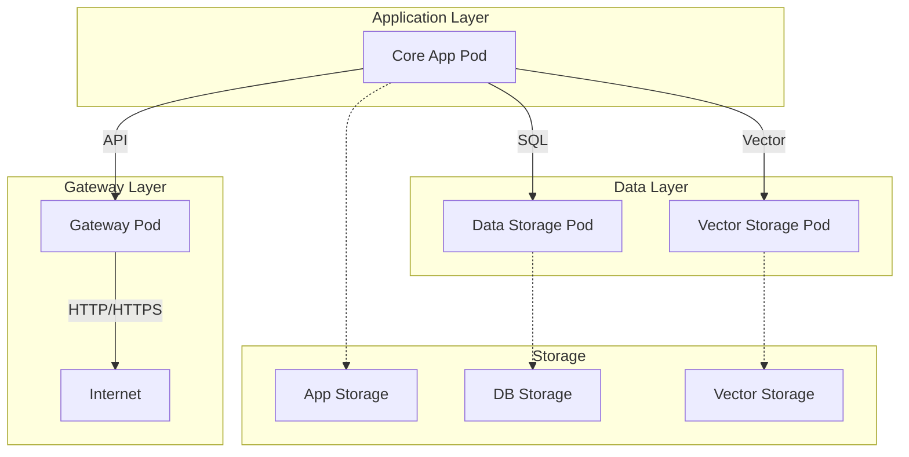

# sjufxxi项目Pod架构设计

**设计时间**: 2025-06-16  
**目标**: 为Kubernetes迁移准备的Pod架构  
**当前状态**: Podman兼容，K8s就绪

## 🏗️ Pod架构概览

### 架构设计原则
1. **业务逻辑分离**: 按功能将服务分组到不同Pod
2. **资源隔离**: 每个Pod独立的资源配置和限制
3. **网络安全**: Pod间通信通过服务发现
4. **数据持久化**: 使用hostPath卷（开发）或PV（生产）
5. **Rootless兼容**: 所有Pod支持非特权运行

### Pod分组策略



## 📦 Pod详细规格

### 1. Core App Pod (核心应用Pod)
**文件**: `core-app-pod.yml`  
**用途**: 主要业务逻辑处理

| 容器 | 镜像 | 端口 | 用途 |
|------|------|------|------|
| api | langgenius/dify-api:1.4.2 | 5001 | REST API服务 |
| worker | langgenius/dify-api:1.4.2 | - | 后台任务处理 |
| web | langgenius/dify-web:1.4.2 | 3000 | 前端界面 |

**资源需求**:
- CPU: 2核 (请求) / 4核 (限制)
- 内存: 4GB (请求) / 8GB (限制)
- 存储: app-storage卷

### 2. Data Storage Pod (数据存储Pod)
**文件**: `data-storage-pod.yml`  
**用途**: 关系型数据和缓存存储

| 容器 | 镜像 | 端口 | 用途 |
|------|------|------|------|
| postgres | postgres:15-alpine | 5432 | 主数据库 |
| redis | redis:6-alpine | 6379 | 缓存和消息队列 |

**资源需求**:
- CPU: 1核 (请求) / 2核 (限制)
- 内存: 2GB (请求) / 4GB (限制)
- 存储: postgres-data + redis-data卷

### 3. Vector Storage Pod (向量存储Pod)
**文件**: `vector-storage-pod.yml`  
**用途**: 向量数据库和AI相关存储

| 容器 | 镜像 | 端口 | 用途 |
|------|------|------|------|
| weaviate | semitechnologies/weaviate:1.25.5 | 8080 | 向量数据库 |

**资源需求**:
- CPU: 1核 (请求) / 2核 (限制)
- 内存: 2GB (请求) / 4GB (限制)
- 存储: weaviate-data卷

### 4. Gateway Pod (网关Pod)
**文件**: `gateway-pod.yml`  
**用途**: 外部访问入口和SSL终端

| 容器 | 镜像 | 端口 | 用途 |
|------|------|------|------|
| nginx | nginx:latest | 80/443 | 反向代理 |
| certbot | certbot/certbot | - | SSL证书管理 |

**资源需求**:
- CPU: 0.5核 (请求) / 1核 (限制)
- 内存: 512MB (请求) / 1GB (限制)
- 存储: nginx-config + certbot卷

## 🚀 部署指南

### Podman部署
```bash
# 创建数据目录
mkdir -p ~/data/{postgres,redis,weaviate,app}
mkdir -p ~/config/{nginx,certbot/conf,certbot/www}

# 设置权限
podman unshare chown -R 999:999 ~/data/postgres
podman unshare chown -R 999:999 ~/data/redis
podman unshare chown -R 1000:1000 ~/data/weaviate
podman unshare chown -R 1000:1000 ~/data/app

# 部署Pod (按顺序)
podman kube play pods/data-storage-pod.yml
podman kube play pods/vector-storage-pod.yml
podman kube play pods/core-app-pod.yml
podman kube play pods/gateway-pod.yml
```

### Kubernetes部署
```bash
# 创建命名空间
kubectl create namespace sjufxxi

# 部署Pod
kubectl apply -f pods/ -n sjufxxi

# 检查状态
kubectl get pods -n sjufxxi
kubectl get services -n sjufxxi
```

## 🔧 配置管理

### 环境变量
所有敏感配置通过环境变量或ConfigMap管理：
- 数据库密码
- API密钥
- 向量数据库认证
- SSL证书配置

### 存储配置
- **开发环境**: hostPath卷
- **生产环境**: PersistentVolume + StorageClass

### 网络配置
- **Pod内通信**: localhost
- **Pod间通信**: 服务名解析
- **外部访问**: Gateway Pod暴露端口

## 📊 监控和日志

### 健康检查
每个容器都配置了：
- **livenessProbe**: 检测容器是否存活
- **readinessProbe**: 检测容器是否就绪

### 日志收集
- 容器日志: `kubectl logs`
- 应用日志: 挂载卷收集
- 系统日志: journald集成

### 监控指标
- CPU/内存使用率
- 网络流量
- 存储I/O
- 应用特定指标

## 🔒 安全配置

### Pod安全
- **runAsNonRoot**: 所有Pod非root运行
- **securityContext**: 明确的用户/组ID
- **readOnlyRootFilesystem**: 只读根文件系统（适用时）

### 网络安全
- **NetworkPolicy**: 限制Pod间通信
- **Service**: 控制服务暴露
- **Ingress**: 外部访问控制

### 数据安全
- **Secrets**: 敏感信息管理
- **ConfigMaps**: 配置数据管理
- **RBAC**: 访问权限控制

## 🔄 扩展和维护

### 水平扩展
- Core App Pod: 可扩展多副本
- Data Storage Pod: 主从复制
- Vector Storage Pod: 集群模式
- Gateway Pod: 负载均衡

### 版本升级
- 滚动更新策略
- 蓝绿部署
- 金丝雀发布

### 备份恢复
- 数据库定期备份
- 配置文件版本控制
- 灾难恢复计划

## 📋 验收标准

### 功能验收
- [ ] 所有Pod正常启动
- [ ] 服务间通信正常
- [ ] 外部访问可用
- [ ] 数据持久化验证

### 性能验收
- [ ] 响应时间<2秒
- [ ] 并发处理>100用户
- [ ] 资源使用率<80%
- [ ] 可用性>99.9%

### 安全验收
- [ ] 非特权运行验证
- [ ] 网络隔离测试
- [ ] 数据加密验证
- [ ] 访问控制测试
